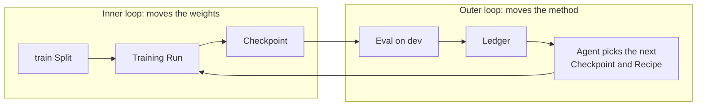

Training a model to where you want it is rarely a single run. You pick a method and some settings, train, look at what came back, and change something. Which methods work is not settled in advance either. It depends on the model you started from, the tasks you care about, and the compute you can spend.

With that many variables in play, the record of what you changed matters as much as the changes themselves. Each one should be visible: what you altered, what it was compared against, and what came back.

It also matters that the change was informed. A decision that reads the results of earlier runs is worth more than a guess. The opposite failure is just as real. If every choice comes from reading the same held-out score, that score stops being an independent measure of the model. It starts reflecting the search that produced it instead.

