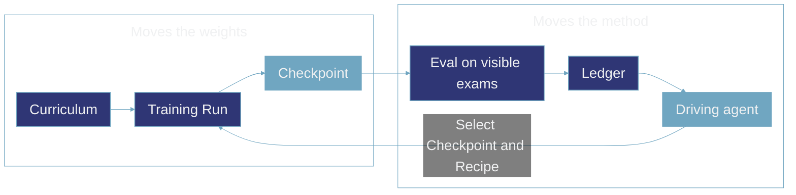
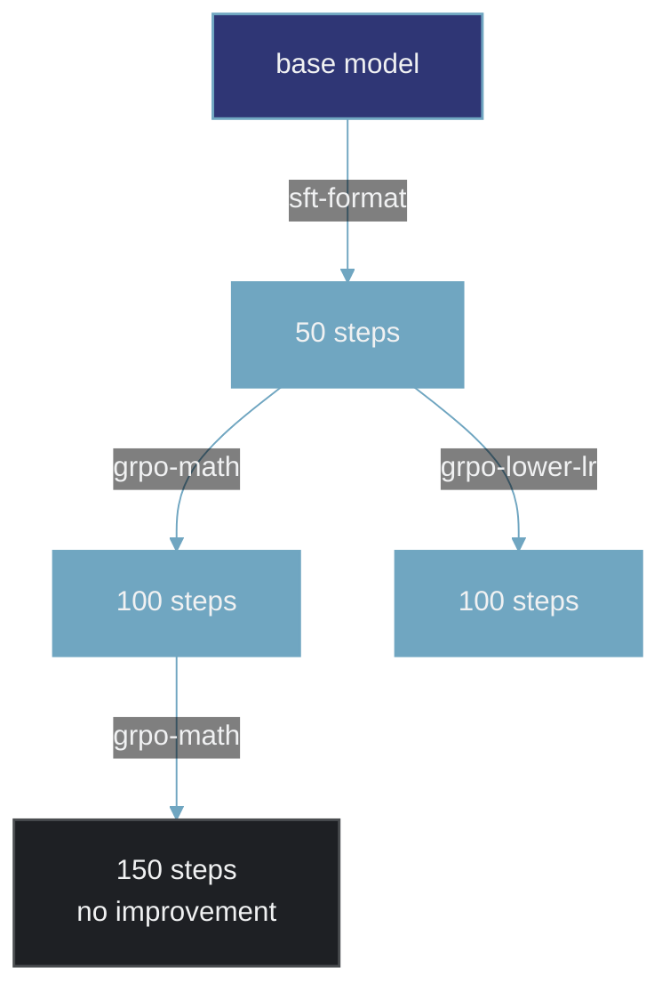

Training a model to where you want it is rarely a single run. You pick a method and some settings, train, look at what came back, and change something. Which methods work is not settled in advance either. It depends on the model you started from, the tasks you care about, and the compute you can spend.

With that many variables in play, the record of what you changed matters as much as the changes themselves. Each one should be visible: what you altered, what it was compared against, and what came back.

The figure below is a high-level view of that work with the driving agent running it. Two things move at different speeds inside it: the model's weights, and the method used to change them.

## Moving the Weights

Training updates the model's weights using one recipe. It is ordinary training: one of the methods described in [Training](/concepts/training), run against the source the run states — a curriculum, or a frozen dataset — for a fixed number of steps. What comes out is a checkpoint, which is the model's saved state after those steps.

The recipe does not change while this runs. Every choice about the method is settled before the first step and holds until the checkpoint is saved. This is the part usually called the inner loop.

## Moving the Method

The checkpoint is then scored on the visible exams, and the results are written to the [Ledger](/concepts/glossary). The ledger holds the baseline and every run since, so it is where you find out what a given recipe did and how that compared to what came before.

The driving agent reads that record and decides the next move, which is the part usually called the outer loop. A move is three choices made together: which checkpoint to start from, what to train on (the source: a curriculum environment, or a frozen dataset of demonstrations), and which recipe to run. Those choices are the arrow back into training, and running it produces one more checkpoint. Nothing is replaced, so the record only ever grows.

If the last recipe produced a measurable improvement, continuing with it is the obvious move. If it did not, the driving agent changes something and tries again.

That is a simplification. Deciding whether a recipe actually helped takes more than one number: the interval around the score, gradient norms and the other training diagnostics, and whether the model has begun overfitting. A single improvement on its own says very little. This page describes the shape of the process rather than the analysis inside it.

Every one of those decisions is made by reading the visible exams. That is what makes them useful, and it is also what disqualifies them as the number you report. A score you have optimized against many times stops being an independent measure of the model and starts reflecting the search that produced it. The sealed exams are held back for the final claim.

## Continue, Branch, or Stage

Every move is one of three kinds.

**Continue.** run the same recipe again on the newest checkpoint.

**Branch.** Start from a checkpoint that is not the newest one. If a learning rate turned out too high, you return to the last checkpoint that looked healthy and go a different way, and the branch that failed stays on the record.

**Stage.** Change the kind of method rather than its settings. Supervised fine-tuning first, so the model becomes competent at the format and the tool-calling conventions, then reinforcement learning on top of those weights to sharpen it.

All three appear below, in a deliberately simple picture of what one of these records could look like. Each box is a checkpoint labelled with the step it was saved at, and each arrow is one training run labelled here with the recipe that ran. (`monte status` labels each hop with its move, as `algorithm:source`.)

The first arrow is a fine-tuning stage, the second is the boundary where the method changes to reinforcement learning, and the fork at 50 steps is a branch retried at a lower learning rate.

All three are the same operation underneath: pick a checkpoint, pick a source, pick a recipe. Because a checkpoint can have more than one child, what builds up is a tree, and one pass through the figure at the top of this page is a single path down it.

## Making the Claim

The search runs until the model reaches the result you were after, or until the budget you set aside runs out. Monte does not make that call. Nothing exits the search automatically, and no rule decides that you have run enough.

The choice of which checkpoint to claim is a nomination. The driving agent states which checkpoint its search presents, and the nominee must carry an admissible eval: a presented model is measured, never merely liked. No rule picks a winner from the scores in its place — with several visible exams, any ranking across them would be a guess — so a search that nominated nothing presents nothing.

The nominated checkpoint is then scored on each sealed exam, and the result is the claim. It is the second of a sealed exam's two touches, and the first is one you take yourself, as a deliberate eval of the base model, before any training begins. Without that first touch nothing could anchor the claim, which is why Monte refuses to train until every exam has its baseline. The rule is two touches per sealed exam per [Cohort](/concepts/glossary), the group of runs that share a base model and the same frozen evaluation settings and can therefore be compared: a third read is refused, and so is a claim on any checkpoint the nomination did not present. The visible exams inform the choice, and the sealed ones confirm it.

If the claim shows an improvement, the checkpoint can be promoted. Promoting exports its servable folder as a checksum-verified copy, behind a confirmation you have to type out in full. If the claim shows no improvement there is nothing worth promoting, and the ledger keeps the record exactly as it stands, but Monte does not decide this for you: `monte promote` exports any succeeded training run's checkpoint that counts as evidence, so the judgement is yours. The tree still shows every method that was tried and what each one scored, so the work has an answer either way.

## Related Pages

<CardGroup cols={3}>
  <Card title="Training" href="/concepts/training">
    What one recipe does to the weights.
  </Card>
  <Card title="Experiment" href="/concepts/experiment">
    What stays fixed across every run.
  </Card>
  <Card title="Glossary" href="/concepts/glossary">
    How the record is kept and read back.
  </Card>
</CardGroup>
