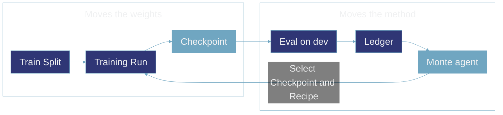
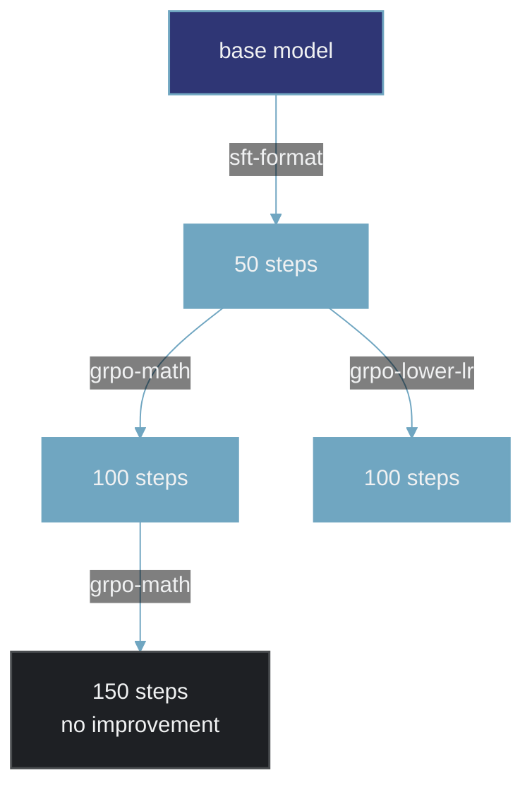

Improvement is the work of making a model better at a defined task. It includes choosing a starting checkpoint, source, recipe, and settings; training a new checkpoint; and evaluating that result against the baseline.

The figure below is a high-level view of that work with the Monte agent running it. Two layers move at different speeds inside it: the model's weights, and the method used to change them.

## Moving the Weights

A training run starts from a checkpoint and uses a fixed recipe with data for a set number of steps to update the model's weights. The recipe defines the algorithm and its settings, while the source identifies the data the run learns from.

The starting checkpoint, source, and recipe stay fixed for the duration of the run; this is the inner loop. The run saves the updated model as a new checkpoint, which can be evaluated and used as the starting point for later training.

## Moving the Method

Monte scores the checkpoint on the dev split and writes the result to the [Ledger](/concepts/glossary), alongside the run's inputs and baseline. The record makes the effect of a recipe, source, or starting checkpoint visible against the runs that came before.

The Monte agent reads that record and chooses the next move: which checkpoint to start from, what to train on, and which recipe to run. It may continue the current path, branch from an earlier checkpoint, or change methods. Each choice produces another checkpoint without replacing an earlier run; this is the outer loop.

Dev guides those choices, but it is not the score to report. A decision should account for more than one score, including its uncertainty and the run's training diagnostics. The test split stays separate for the final claim.

## Continue, Branch, or Stage

Every move is one of three kinds.

**Continue:** Run the same recipe again on the newest checkpoint.

**Branch:** Start from a checkpoint that is not the newest one. If a learning rate turned out too high, the search returns to the last checkpoint that looked healthy and goes a different way, and the branch that failed stays on the record.

**Stage:** Change the kind of method rather than its settings. Supervised fine-tuning first, so the model becomes competent at the format and the tool-calling conventions, then reinforcement learning on top of those weights to sharpen it.

All three appear below, in a deliberately simple picture of what one of these records could look like. Each box is a checkpoint labelled with the step it was saved at, and each arrow is one training run labelled here with the recipe that ran. (`monte status` labels each hop with its move, as `algorithm:source`.)

The first arrow is a fine-tuning stage, the second is the boundary where the method changes to reinforcement learning, and the fork at 50 steps is a branch retried at a lower learning rate.

All three are the same operation underneath: pick a checkpoint, pick a source, pick a recipe. Because a checkpoint can have more than one child, what builds up is a tree, and one pass through the figure at the top of this page is a single path down it.

## Making the Claim

The search runs until the model reaches the target or the budget runs out; Monte does not decide when to stop. Monte then selects the checkpoint with the greatest paired `dev` improvement over the Baseline, measured task by task. Every candidate and the Baseline must have readable per-task results, or Monte refuses to select rather than compare an incomplete set.

The selected checkpoint is scored on `test`, and that result is the claim. The base model's test baseline must already exist, so the claim is the second of the two test reads allowed in a [Cohort](/concepts/glossary). Without that baseline, a claim has nothing to compare against; Monte also refuses a third test read or a claim for a checkpoint it did not select. Dev selects; test confirms.

A checkpoint that counts as evidence can be promoted. Promotion exports its servable folder as a checksum-verified copy behind a typed confirmation. Whether a result is worth promoting remains an operator decision, while the ledger preserves every method tried and its score.

## Related Pages

<CardGroup cols={3}>
  <Card title="Training" href="/concepts/training">
    What one recipe does to the weights.
  </Card>
  <Card title="Experiment" href="/concepts/experiment">
    What stays fixed across every run.
  </Card>
  <Card title="Glossary" href="/concepts/glossary">
    How the record is kept and read back.
  </Card>
</CardGroup>
