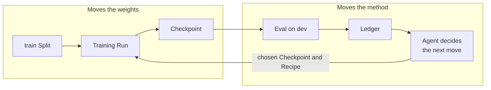
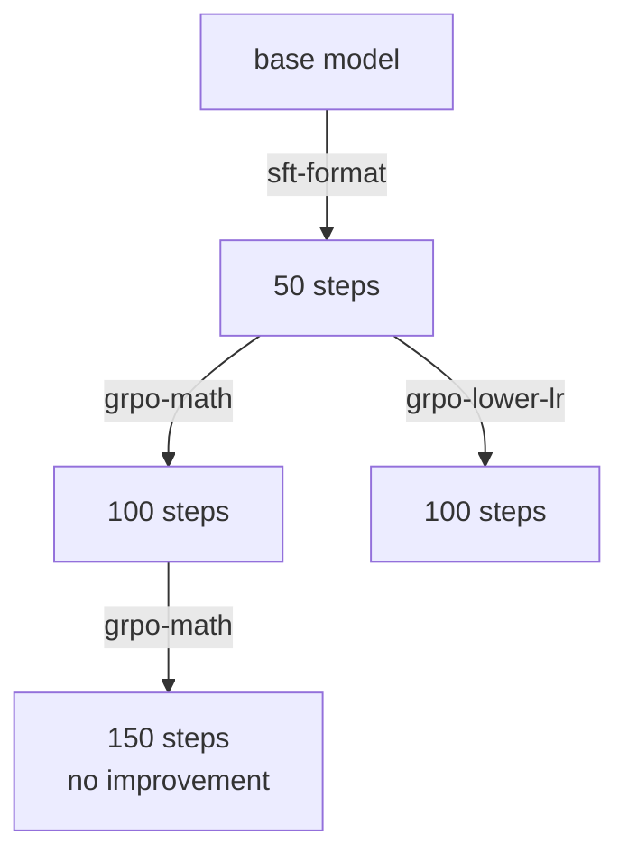

Training a model to where you want it is rarely a single run. You pick a method and some settings, train, look at what came back, and change something. Which methods work is not settled in advance either. It depends on the model you started from, the tasks you care about, and the compute you can spend.

With that many variables in play, the record of what you changed matters as much as the changes themselves. Each one should be visible: what you altered, what it was compared against, and what came back.

The figure below is a high-level view of that work with an agent driving it. Two things move at different speeds inside it: the model's weights, and the method used to change them.

## Moving the weights

Training updates the model's weights using one Recipe. It is ordinary training: one of the methods described in [Training](/concepts/training), run against the `train` Split for a fixed number of steps. What comes out is a Checkpoint, which is the model's saved state after those steps.

Nothing in this half is unusual, and the Recipe does not change while it runs. This is the part usually called the inner loop.

## Moving the method

The Checkpoint is then scored on the `dev` Split, and the result is written to the [Ledger](/concepts/runs-ledger). The Ledger holds the Baseline and every Run since, so it is where you find out what a given Recipe did and how that compared to what came before.

The agent reads that record and decides the next move. A move is two choices made together: which Checkpoint to start from, and which Recipe to run on it. Those two choices are the arrow back into training, and running it produces one more Checkpoint. Nothing is replaced, so the record only ever grows.

If the last Recipe produced a measurable improvement, continuing with it is the obvious move. If it did not, the agent changes something and tries again.

Every one of those decisions is made by reading `dev`. That is what makes `dev` useful, and it is also what disqualifies it as the number you report. A score you have optimized against many times stops being an independent measure of the model and starts reflecting the search that produced it. The `test` Split is held back for the final claim.

## Continue, branch, or stage

Calling this an outer loop is accurate only in its simplest form, where the agent runs the same Recipe again on the newest Checkpoint. Two other moves are just as ordinary.

**Branch.** The agent starts from a Checkpoint that is not the newest one. If a learning rate turned out too high, there is no reason to keep building on what it produced. You return to the last Checkpoint that looked healthy and go a different way from there, and the arm that failed stays on the record.

**Stage.** The agent changes the kind of method rather than its settings. Supervised fine-tuning first, so the model becomes competent at the format and the tool-calling conventions, then reinforcement learning on top of those weights to sharpen it. The second stage starts from the first stage's Checkpoint and runs a Recipe from a different family. Neither method has to finish the job alone, which is why this pairing is the common one.

All three appear in the record below. Each box is a Checkpoint, labelled with the step it was saved at, and each arrow is one training Run labelled with the Recipe that ran.

The first arrow is a supervised fine-tuning stage. The second is the stage boundary, where the method changes to reinforcement learning on top of the weights that fine-tuning produced. The fork back at 50 steps is a branch: the same reinforcement learning method retried at a lower learning rate, after the first arm stopped improving.

All three moves are the same operation underneath: pick a Checkpoint, pick a Recipe. What differs is how far the new Recipe sits from the old one, and where you attached it. Because a Checkpoint can have more than one child, what builds up is a tree, and any single pass through the figure at the top of this page is one path down it.
