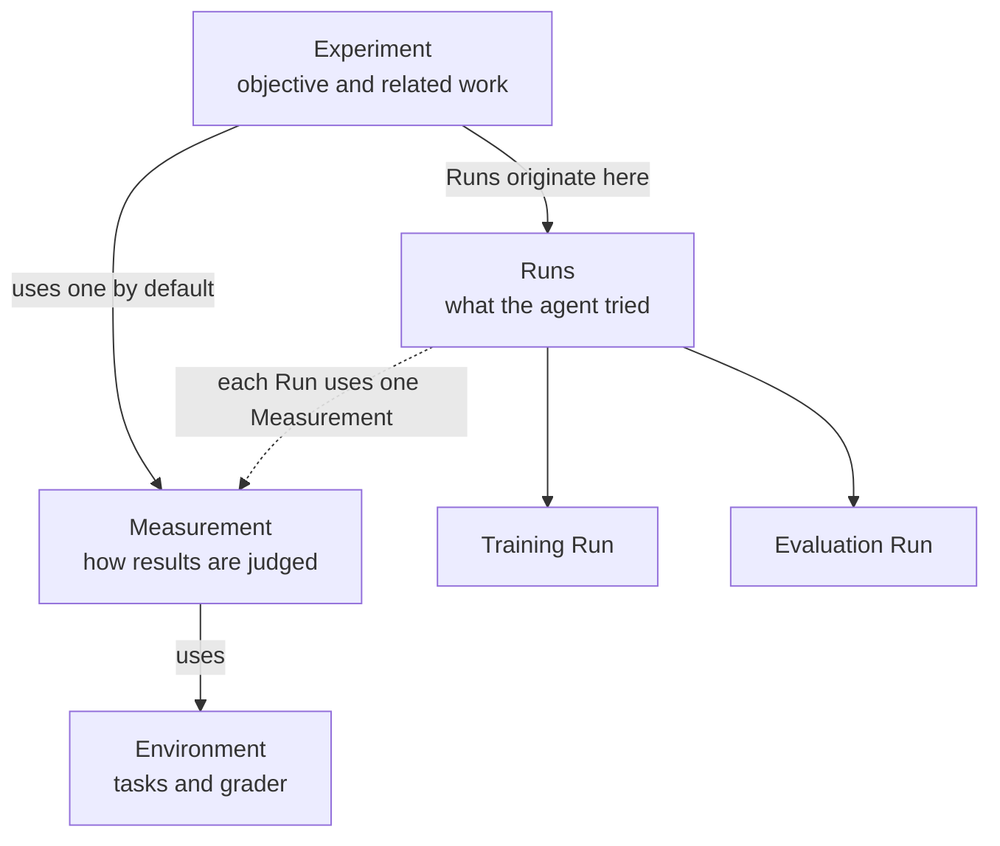

AI agents can handle individual tasks in LLM post-training research. They can change a training recipe, launch an experiment, or inspect an evaluation. They are much less reliable at managing the improvement process as a whole.

An agent can become anchored to an early diagnosis and keep working from it after the evidence changes. It can focus on one result or metric while losing sight of the wider direction. It may compare results produced under different conditions, repeat earlier work, or fail to reconsider a weak approach. The agent can appear productive at each step while the overall improvement process drifts.

Monte gives agents a consistent view of that process. It records the context behind each result and how the work changes over time. Agents can use this record to manage several lines of work, revisit decisions, and choose what to try next.

Monte is opinionated about what must be known for a comparison to mean something. It remains open about the training method, framework, and research strategy.

<Note>
Monte is in closed beta. Interfaces and these docs change quickly, and commands can break between versions.
</Note>

## How it works

An Experiment groups related work around one objective. It uses one Measurement by default, but it can use more. A Measurement defines how Monte judges results. The Measurement uses an Environment, which supplies the tasks and grader. Each training or evaluation is a Run. Every Run belongs to one Experiment and records its model, configuration, results, artifacts, cost, and provenance.

## Start here

<CardGroup cols={3}>
  <Card title="Quickstart" href="/quickstart">
    Run the loop on your laptop in minutes. No GPU.
  </Card>
  <Card title="The loop" href="/concepts/loop">
    How training becomes evidence of improvement.
  </Card>
  <Card title="CLI reference" href="/cli/overview">
    Every command, flag, and exit code.
  </Card>
</CardGroup>
