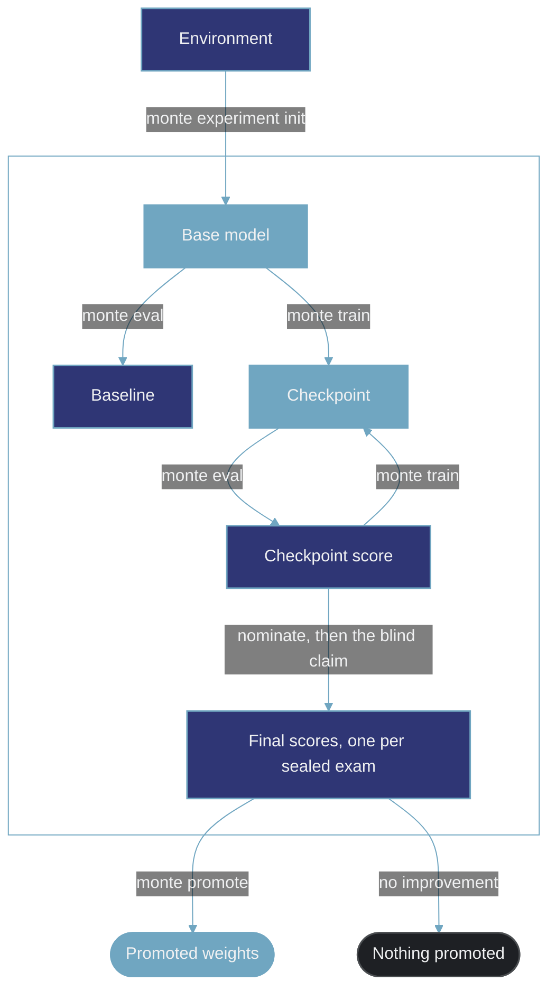

**Monte is the agent-native platform for post-training.**

AI agents can handle the individual tasks of post-training research well. They can change a training method, launch a run, or inspect an evaluation. They are much less reliable at managing the improvement process as a whole.

An agent may become overly convinced of an early diagnosis and keep working from it after the evidence points in a different direction. It can chase a single metric and lose the broader goal. It may compare results produced under different conditions, repeat work it already did, or stick with an approach that stopped paying off. At each step it looks productive, while the process as a whole degrades.

Monte gives agents a consistent view of that process. It records the context behind each result and how the work changes over time, so an agent can make informed decisions about what to try next.

Monte pins down everything a comparison depends on. A result is read only against others produced the same way — the same base model, the same frozen tasks, the same evaluation settings — and each of those groups keeps its own baseline. Monte is opinionated about the shape an experiment runs under, and not at all about the training algorithm or research strategy.

## How It Works

Monte covers the post-training loop end to end. An environment supplies the work — its tasks, tools, state, and a grader — and a model is evaluated against it, trained with supervised fine-tuning or reinforcement learning, then evaluated again. The gap between those two numbers is the result.

That result can only be credited to the training if both evaluations ran under identical conditions. Monte freezes those conditions at the moment an experiment is defined: the exact list of tasks in each exam, that exam's decoding settings, how many attempts each task gets, and the grader that scores them. That consistency is strictly enforced, not merely recorded: Monte refuses a training run once any of it has changed.

Monte runs from both a CLI and a web console, reading the same record. Humans and agents can therefore collaborate across projects: an agent reads what has already been tried and what it scored rather than inferring it, and a human can monitor the work as it happens.

Under Monte, an experiment follows a specific structure, and that structure is strictly enforced. It runs over a set of exams in two roles: visible exams, which the loop scores freely and reasons over, and sealed exams, which it can never evaluate. The base model is scored on every exam before any training, and those scores are the baselines — a visible baseline is what later runs are read against, and a sealed baseline anchors the final claim. Every checkpoint after that is trained under a stated recipe and scored against the baseline. Each run records the recipe it ran and the source it trained on, so the method behind a number is never lost.

Everything in the box below happens under a single experiment.

Each sealed exam is read twice: once on the base model before any training, and once at the end, on the checkpoint the search nominates. Those final reads are the numbers worth reporting — one score per sealed exam, and nothing merges them into one. If a score is worth keeping, `monte promote` exports the checkpoint's weights together with the settings of the run that produced them. Every run, score, and cost lands in one record, and agents read it to decide what to try next.

## Start Here

<CardGroup cols={3}>
  <Card title="Quickstart" href="/quickstart">
    run the loop on a laptop in minutes. No GPU.
  </Card>

  <Card title="Improvement" href="/concepts/improvement">
    How training becomes evidence of improvement.
  </Card>

  <Card title="CLI" href="/cli/overview">
    Every command, flag, and exit code.
  </Card>
</CardGroup>