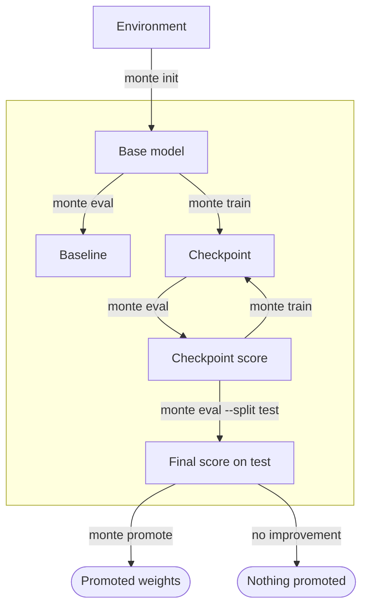

AI agents can handle individual tasks in LLM post-training research. They can change a Recipe, launch a Run, or inspect an evaluation. They are much less reliable at managing the improvement process as a whole.

An agent can become anchored to an early diagnosis and keep working from it after the evidence changes. It can focus on one result or metric while losing sight of the wider direction. It may compare results produced under different conditions, repeat earlier work, or fail to reconsider a weak approach. The agent can appear productive at each step while the overall improvement process drifts.

Monte gives agents a consistent view of that process. It records the context behind each result and how the work changes over time. Agents can use this record to revisit decisions and choose what to try next.

Monte is opinionated about what must be known for a comparison to mean something. It remains open about the training method and research strategy.

<Note>
Monte is in closed beta. Interfaces and these docs change quickly, and commands can break between versions.
</Note>

## How it works

Monte is an abstraction layer over the training lifecycle. It holds what each training Run did, what each eval scored, and how a model does on one task.

An Environment is the standard object that carries what you need to score that task: the Tasks, their answers, and the grader. One Environment can carry several Measurements. `monte init` creates a Measurement and fixes which Tasks you score and how you score them.

A Measurement starts from a base model, and that can be any model you want to start from. Monte scores it first to set the Baseline, then you train and score each new Checkpoint against it. A Recipe states how a Run trains: the algorithm, the optimizer, the batch geometry, and how it spreads over GPUs. Each Run records the Recipe it ran, so the method behind a number is never lost. Monte writes the run plan, the events, and the training logs in one standard format. You can see from them which settings to change next.

Everything in the box below happens under one Measurement.

The final eval on the test Split decides whether you can promote the model. Every Run, score, and cost lands in that same standard format. An agent reads that record, runs the loop, and decides what to try next.

## Start here

<CardGroup cols={3}>
  <Card title="Quickstart" href="/quickstart">
    Run the loop on your laptop in minutes. No GPU.
  </Card>
  <Card title="The loop" href="/concepts/loop">
    How training becomes evidence of improvement.
  </Card>
  <Card title="CLI reference" href="/cli/overview">
    Every command, flag, and exit code.
  </Card>
</CardGroup>
