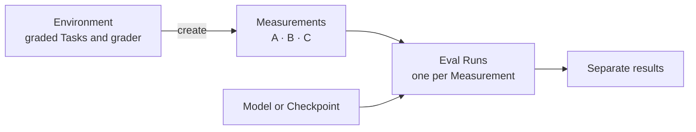

AI agents can handle individual tasks in LLM post-training research. They can change a Recipe, launch a Run, or inspect an evaluation. They are much less reliable at managing the improvement process as a whole.

An agent can become anchored to an early diagnosis and keep working from it after the evidence changes. It can focus on one result or metric while losing sight of the wider direction. It may compare results produced under different conditions, repeat earlier work, or fail to reconsider a weak approach. The agent can appear productive at each step while the overall improvement process drifts.

Monte gives agents a consistent view of that process. It records the context behind each result and how the work changes over time. Agents can use this record to revisit decisions and choose what to try next.

Monte is opinionated about what must be known for a comparison to mean something. It remains open about the training method and research strategy.

<Note>
Monte is in closed beta. Interfaces and these docs change quickly, and commands can break between versions.
</Note>

## How it works

An Environment supplies graded Tasks and a grader. You can create several Measurements from one Environment. Each Measurement freezes a different evaluation contract.

An eval Run applies one Measurement to one model or Checkpoint. If you apply three Measurements, Monte records three eval Runs and three separate results.

A Training Run uses a Recipe and produces a Checkpoint. You then choose which Measurements to apply to that Checkpoint. Each Measurement records its eval Runs in its own Ledger. Each Cohort has its own Baseline, so deltas never cross a Cohort boundary.

Today, a Checkpoint stays inside the Measurement whose Training Run produced it. You cannot yet apply several Measurements to one produced Checkpoint. Monte supports this relationship for base models, but the Checkpoint workflow needs a platform change.

## Start here

<CardGroup cols={3}>
  <Card title="Quickstart" href="/quickstart">
    Run the loop on your laptop in minutes. No GPU.
  </Card>
  <Card title="The loop" href="/concepts/loop">
    How training becomes evidence of improvement.
  </Card>
  <Card title="CLI reference" href="/cli/overview">
    Every command, flag, and exit code.
  </Card>
</CardGroup>
