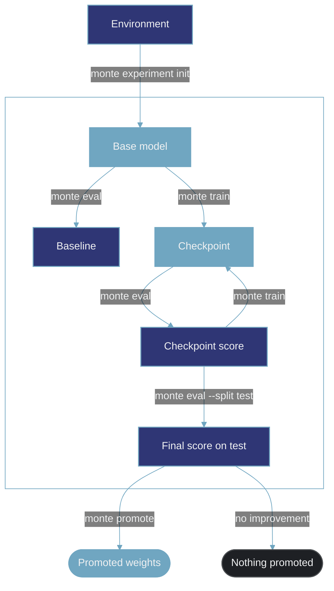

Monte runs the post-training loop: train, evaluate, compare. It records the conditions every Run ran under, and the Improver works the loop from that record.

AI agents can handle individual tasks in LLM post-training research. They can change a Recipe, launch a Run, or inspect an evaluation. They are much less reliable at managing the improvement process as a whole.

An agent can become anchored to an early diagnosis and keep working from it after the evidence changes. It can focus on a single result or metric while losing sight of the broader direction. It may compare results produced under different conditions, repeat earlier work, or fail to reconsider a weak approach. The agent can appear productive at each step while the overall improvement process drifts.

Monte gives agents a consistent view of that process. It records the context behind each result and how the work changes over time. Agents can use this record to revisit decisions and choose what to try next.

Monte fixes what must be known for a comparison to mean something. Runs that share one base model, one frozen Environment, and one set of eval settings form a Cohort. Each Cohort gets its own Baseline, and a delta never crosses from one Cohort into another. Monte does not constrain the training method or the research strategy.

<Note>
  Monte is in closed beta. Interfaces and these docs change quickly, and commands can break between versions.
</Note>

## How it works

Monte holds what each training Run did, what each eval scored, and how a model performs on a given Task.

An Environment carries what you need to score a Task: the Tasks, their answers, and the grader. One Environment can carry several Measurements. `monte experiment init` creates a Measurement and fixes which Tasks you score and how you score them. The CLI spells the verb `experiment`, and these docs call the object it creates a Measurement. An experiment is a Measurement over a trainable Environment, one whose tasks you can also train on. A Measurement over an eval-only Environment is an eval-only Measurement, a fixed reference any model can be scored against.

A Measurement starts from a base model, which can be any model. You score that base model twice before any training: on the `dev` Split, which sets the Baseline, and on the `test` Split, which anchors the final claim. Then you train and score each new Checkpoint against the Baseline. A Recipe states how a Run trains: the algorithm, the optimizer, the batch settings, and how it is distributed across GPUs. Each Run records the Recipe it ran and the Source it trained on, so the method behind a number is never lost. Monte writes the run plan, events, and training logs in the same shape for every Run. You can see from them which settings to change next.

Everything in the box below happens under one Measurement.

The test Split is read twice: once on the base model before any training, and once on the Checkpoint the search presents at the end. The final eval on the test Split is the number you report. `monte promote` copies a Checkpoint's weights out with its provenance, behind a confirmation you type in full. Every Run, score, and cost is recorded in that same shape. The Improver reads that record, runs the loop, and decides what to try next.

## Start here

<CardGroup cols={3}>
  <Card title="Quickstart" href="/quickstart">
    Run the loop on your laptop in minutes. No GPU.
  </Card>

  <Card title="Improvement" href="/concepts/improvement">
    How training becomes evidence of improvement.
  </Card>

  <Card title="CLI reference" href="/cli/overview">
    Every command, flag, and exit code.
  </Card>
</CardGroup>